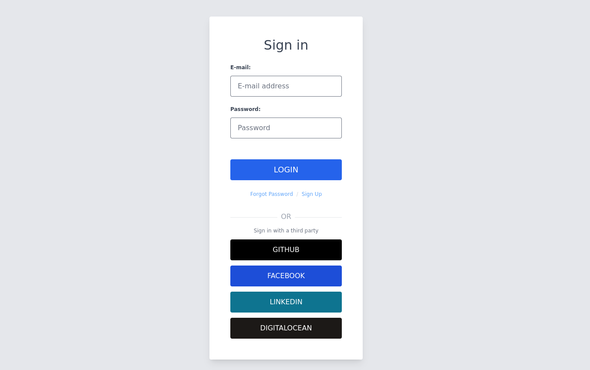
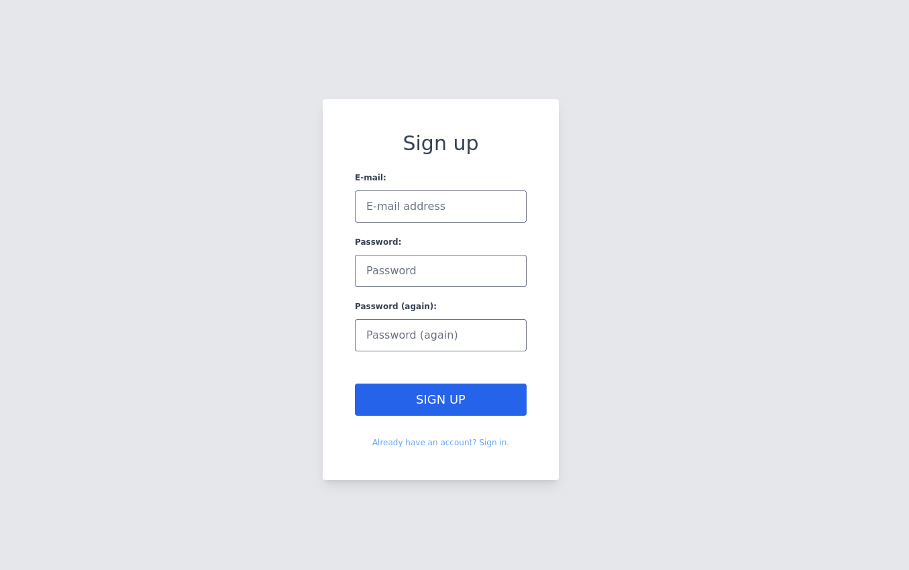
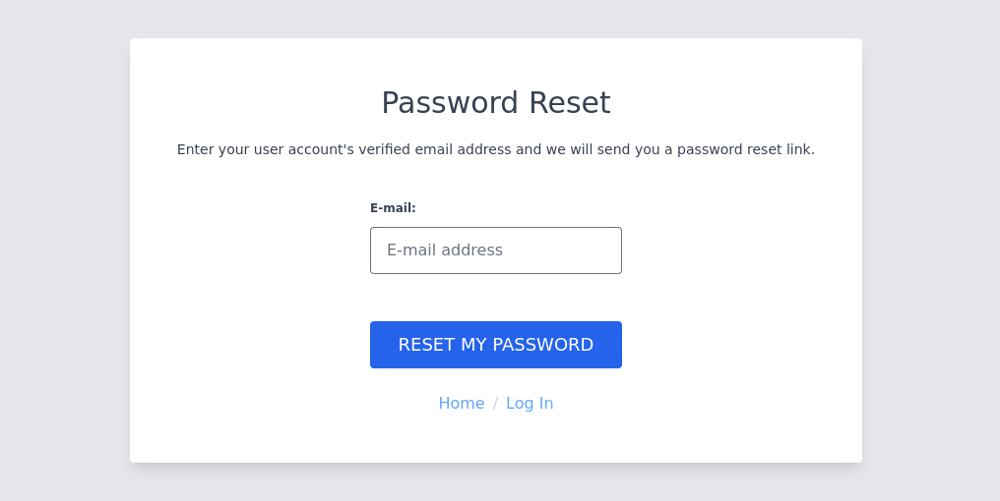

# Django Errors UI

UI templates for HTTP errors built with Tailwind.

* [Django Errors UI](#allauth-ui)
   * [Features](#features)
   * [Installation](#installation)
   * [Screenshots](#screenshots)

## Features

- Responsive design suitable for device sizes from mobile to desktop

## Installation

```
pip install django-errors-ui
```
```python
INSTALLED_APPS = [
    "django_errors_ui",
]
```
**Note**:

When going to **production** you should run ```python manage.py collectstatic```

## Screenshots





### Generating screenshots

```
convert "$1" -crop 1072x901+436+200 crop_signin.png
```

### Hacking on the project

```sh
# Clone the repo
git clone git@github.com:danihodovic/django-errors-ui.git
cd django-errors-ui.git

# Create the virtual env
python -m venv .venv
# Activate the virtual env. This has to be done every time you enter the directory.
source .venv/bin/activate

# Install the dependencies
pip install --upgrade pip poetry
poetry install

# Install tailwind
npm install

# Run the migrations
./manage.py migrate

# Add sample social providers
./manage.py create_test_providers

# Start the server
./manage.py runserver_plus

# Start the tailwind compilation process in another terminal
npm run-script build:watch
```

Make changes in allauth_ui/templates and open the browser at http://localhost:8000/accounts/login/.

Once you're done compile tailwind with `npm run-script build` and submit a pull-request 🃏
